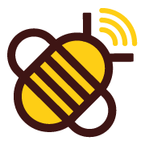

<p align="center">
  
</p>

# Honey Instruments Integration for Home Assistant

[](https://github.com/mock3t/home-assistant-honey-instruments/actions/workflows/hacs.yaml)
[](https://github.com/mock3t/home-assistant-honey-instruments/actions/workflows/hassfest.yaml)
[](https://github.com/mock3t/home-assistant-honey-instruments/actions/workflows/ruff.yaml)

Custom integration for [Home Assistant](https://www.home-assistant.io/) to retrieve data from [Honey Instruments](https://www.honeyinstruments.com/) connected beehive scales.

## Sensors

| Sensor | Type | Unit | Description |
| --- | --- | --- | --- |
| Weight | Weight | kg | Current hive weight |
| Weight variation (1h) | Weight | kg | Weight change over the last hour |
| Weight variation (24h) | Weight | kg | Weight change over the last 24 hours |
| Weight variation (7d) | Weight | kg | Weight change over the last 7 days |
| Temperature | Temperature | °C | Balance temperature |
| Battery voltage | Voltage | mV | Balance battery level |
| Signal strength | Signal | dB | Communication signal strength |
| External temperature | Temperature | °C | External probe temperature |
| External humidity | Humidity | % | External probe humidity |
| External battery voltage | Voltage | mV | External probe battery level |

## Prerequisites

1. A Honey Instruments connected beehive scale
2. Your Honey Instruments account credentials (email + password)

## Installation

### HACS (recommended)

1. Open HACS in your Home Assistant instance
2. Click the three dots in the top right corner and select **Custom repositories**
3. Add this repository URL and select **Integration** as category
4. Click **Download** on the Honey Instruments integration
5. Restart Home Assistant

### Manual

1. Copy the `custom_components/honey_instruments` folder into your `config/custom_components/` directory
2. Restart Home Assistant

## Configuration

1. Go to **Settings** > **Devices & Services** > **Add Integration**
2. Search for **Honey Instruments**
3. Enter your email and password
4. Your devices and sensors will be automatically discovered

### Options

After setup, you can configure the polling interval via **Settings** > **Devices & Services** > **Honey Instruments** > **Configure**.

The default scan interval is 3600 seconds (1 hour). You can set it between 600 seconds (10 minutes) and 86400 seconds (24 hours).

## Development

### Setup

```bash
scripts/setup
```

### Run Home Assistant locally

```bash
scripts/develop
```

Home Assistant will be available at `http://localhost:8123`.

### VS Code

A task is available in VS Code: **Run Home Assistant on port 8123**.

## License

This project is licensed under the MIT License - see the [LICENSE](LICENSE) file for details.
